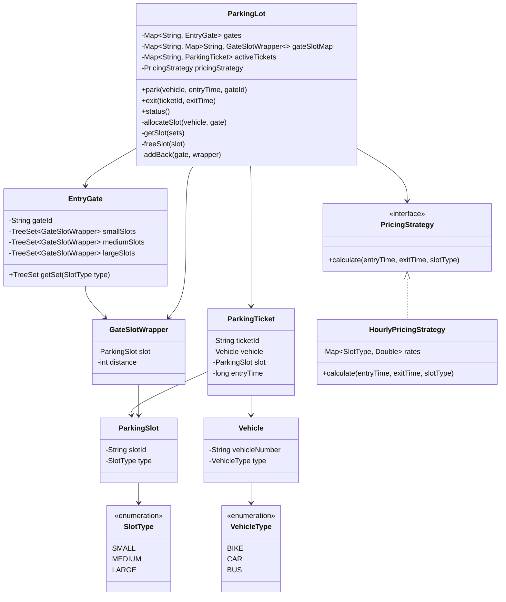

```mermaid
classDiagram

%% ================= ENUMS =================
class VehicleType {
  <<enumeration>>
  BIKE
  CAR
  BUS
}

class SlotType {
  <<enumeration>>
  SMALL
  MEDIUM
  LARGE
}

%% ================= CORE ENTITIES =================
class Vehicle {
  -String vehicleNumber
  -VehicleType type
}

class ParkingSlot {
  -String slotId
  -SlotType type
}

class GateSlotWrapper {
  -ParkingSlot slot
  -int distance
}

class ParkingTicket {
  -String ticketId
  -Vehicle vehicle
  -ParkingSlot slot
  -long entryTime
}

%% ================= ENTRY GATE =================
class EntryGate {
  -String gateId
  -TreeSet~GateSlotWrapper~ smallSlots
  -TreeSet~GateSlotWrapper~ mediumSlots
  -TreeSet~GateSlotWrapper~ largeSlots

  +TreeSet getSet(SlotType type)
}

%% ================= PRICING =================
class PricingStrategy {
  <<interface>>
  +calculate(entryTime, exitTime, slotType)
}

class HourlyPricingStrategy {
  -Map~SlotType, Double~ rates
  +calculate(entryTime, exitTime, slotType)
}

PricingStrategy <|.. HourlyPricingStrategy

%% ================= PARKING LOT =================
class ParkingLot {
  -Map~String, EntryGate~ gates
  -Map~String, Map~String, GateSlotWrapper~~ gateSlotMap
  -Map~String, ParkingTicket~ activeTickets
  -PricingStrategy pricingStrategy

  +park(vehicle, entryTime, gateId)
  +exit(ticketId, exitTime)
  +status()

  -allocateSlot(vehicle, gate)
  -getSlot(sets)
  -freeSlot(slot)
  -addBack(gate, wrapper)
}

%% ================= RELATIONSHIPS =================

Vehicle --> VehicleType
ParkingSlot --> SlotType

ParkingTicket --> Vehicle
ParkingTicket --> ParkingSlot

GateSlotWrapper --> ParkingSlot

EntryGate --> GateSlotWrapper

ParkingLot --> EntryGate
ParkingLot --> ParkingTicket
ParkingLot --> PricingStrategy
ParkingLot --> GateSlotWrapper
```