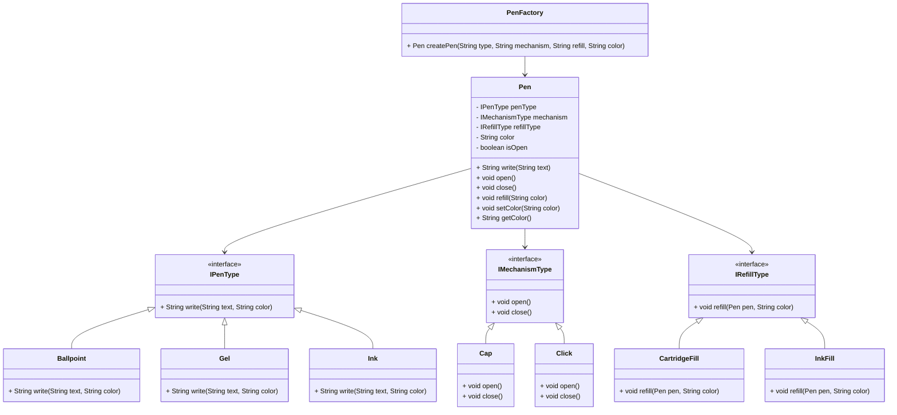

```mermaid
classDiagram

class Pen {
  - IPenType penType
  - IMechanismType mechanism
  - IRefillType refillType
  - String color
  - boolean isOpen
  + String write(String text)
  + void open()
  + void close()
  + void refill(String color)
  + void setColor(String color)
  + String getColor()
}

class IPenType {
  <<interface>>
  + String write(String text, String color)
}

class Ballpoint {
  + String write(String text, String color)
}

class Gel {
  + String write(String text, String color)
}

class Ink {
  + String write(String text, String color)
}

class IMechanismType {
  <<interface>>
  + void open()
  + void close()
}

class Cap {
  + void open()
  + void close()
}

class Click {
  + void open()
  + void close()
}

class IRefillType {
  <<interface>>
  + void refill(Pen pen, String color)
}

class CartridgeFill {
  + void refill(Pen pen, String color)
}

class InkFill {
  + void refill(Pen pen, String color)
}

class PenFactory {
  + Pen createPen(String type, String mechanism, String refill, String color)
}

%% Relationships
Pen --> IPenType
Pen --> IMechanismType
Pen --> IRefillType

IPenType <|-- Ballpoint
IPenType <|-- Gel
IPenType <|-- Ink

IMechanismType <|-- Cap
IMechanismType <|-- Click

IRefillType <|-- CartridgeFill
IRefillType <|-- InkFill

PenFactory --> Pen
```