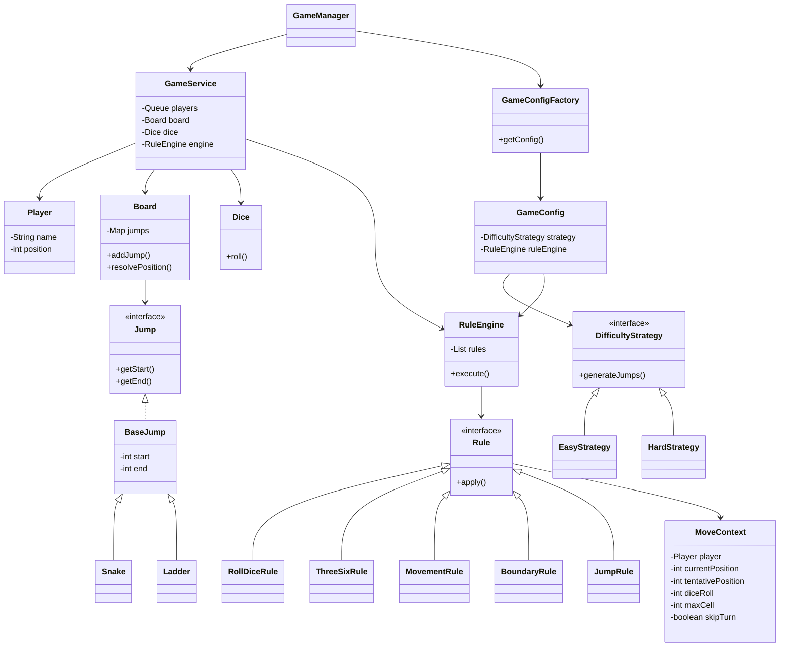

```mermaid
classDiagram

class GameManager
class GameService {
  -Queue<Player> players
  -Board board
  -Dice dice
  -RuleEngine engine
}

class Player {
  -String name
  -int position
}

class Dice {
  +roll()
}

class Board {
  -Map<Integer, Jump> jumps
  +addJump()
  +resolvePosition()
}

class Jump {
  <<interface>>
  +getStart()
  +getEnd()
}

class BaseJump {
  -int start
  -int end
}

class Snake
class Ladder

Jump <|.. BaseJump
BaseJump <|-- Snake
BaseJump <|-- Ladder

GameService --> Player
GameService --> Board
GameService --> Dice
GameService --> RuleEngine

Board --> Jump

class DifficultyStrategy {
  <<interface>>
  +generateJumps()
}

class EasyStrategy
class HardStrategy

DifficultyStrategy <|-- EasyStrategy
DifficultyStrategy <|-- HardStrategy

class Rule {
  <<interface>>
  +apply()
}

class RuleEngine {
  -List<Rule> rules
  +execute()
}

RuleEngine --> Rule

class RollDiceRule
class ThreeSixRule
class MovementRule
class BoundaryRule
class JumpRule

Rule <|-- RollDiceRule
Rule <|-- ThreeSixRule
Rule <|-- MovementRule
Rule <|-- BoundaryRule
Rule <|-- JumpRule

class MoveContext {
  -Player player
  -int currentPosition
  -int tentativePosition
  -int diceRoll
  -int maxCell
  -boolean skipTurn
}

Rule --> MoveContext

class GameConfig {
  -DifficultyStrategy strategy
  -RuleEngine ruleEngine
}

class GameConfigFactory {
  +getConfig()
}

GameConfigFactory --> GameConfig
GameConfig --> DifficultyStrategy
GameConfig --> RuleEngine

GameManager --> GameService
GameManager --> GameConfigFactory
```