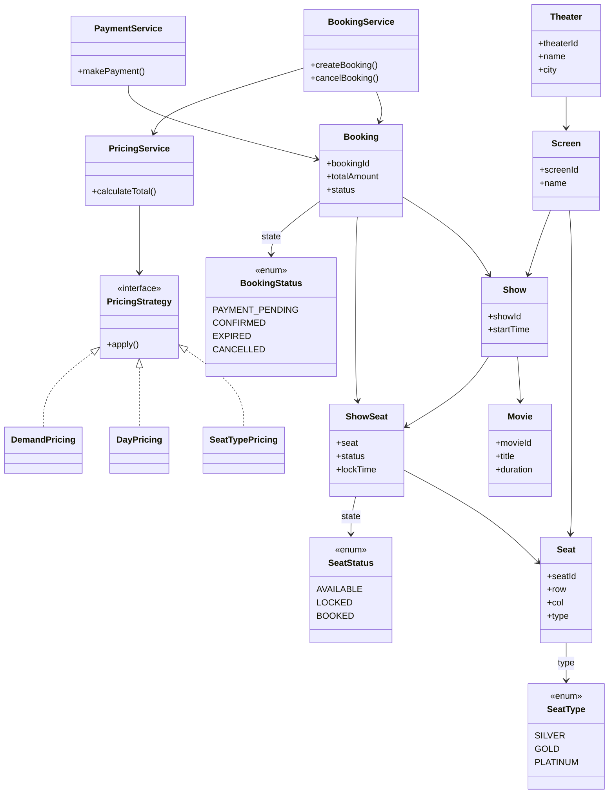

```mermaid
classDiagram

%% ===================== ENUMS =====================
class SeatStatus {
  <<enum>>
  AVAILABLE
  LOCKED
  BOOKED
}

class BookingStatus {
  <<enum>>
  PAYMENT_PENDING
  CONFIRMED
  EXPIRED
  CANCELLED
}

class SeatType {
  <<enum>>
  SILVER
  GOLD
  PLATINUM
}

%% ===================== CORE =====================

class Movie {
  +movieId
  +title
  +duration
}

class Theater {
  +theaterId
  +name
  +city
}

class Screen {
  +screenId
  +name
}

class Seat {
  +seatId
  +row
  +col
  +type
}

class ShowSeat {
  +seat
  +status
  +lockTime
}

class Show {
  +showId
  +startTime
}

class Booking {
  +bookingId
  +totalAmount
  +status
}

%% ===================== SERVICES =====================

class BookingService {
  +createBooking()
  +cancelBooking()
}

class PaymentService {
  +makePayment()
}

class PricingService {
  +calculateTotal()
}

class PricingStrategy {
  <<interface>>
  +apply()
}

%% ===================== RELATIONSHIPS =====================

Theater --> Screen
Screen --> Seat
Screen --> Show
Show --> Movie
Show --> ShowSeat
ShowSeat --> Seat
Booking --> Show
Booking --> ShowSeat

BookingService --> Booking
BookingService --> PricingService
PaymentService --> Booking

PricingService --> PricingStrategy

%% Strategy implementations
PricingStrategy <|.. SeatTypePricing
PricingStrategy <|.. DayPricing
PricingStrategy <|.. DemandPricing

%% Important enum relationships
ShowSeat --> SeatStatus : state
Booking --> BookingStatus : state
Seat --> SeatType : type
```